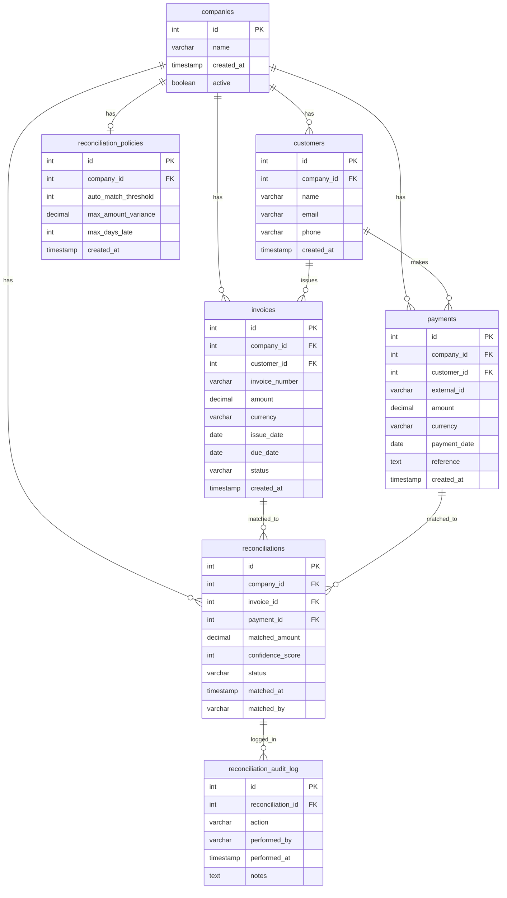

# Invoice Reconciliation System - Database Schema

## Entity Relationship Diagram

## Table Relationships

### Core Entities

1. **companies** (Root Entity)
   - Central entity for multi-tenancy
   - All other tables link back to companies

2. **customers**
   - Belongs to: `companies`
   - Has many: `invoices`, `payments`
   - Constraint: Unique email per company

3. **invoices**
   - Belongs to: `companies`, `customers`
   - Has many: `reconciliations`
   - Statuses: OPEN, PARTIALLY_MATCHED, FULLY_MATCHED, OVERDUE

4. **payments**
   - Belongs to: `companies`, `customers`
   - Has many: `reconciliations`
   - Unique: external_id (bank reference)

### Reconciliation System

5. **reconciliations** (Junction Table)
   - Links: `invoices` ↔ `payments` (many-to-many)
   - Belongs to: `companies`
   - Has many: `reconciliation_audit_log`
   - Statuses: AUTO-MATCHED, PENDING_REVIEW, REJECTED

6. **reconciliation_policies**
   - One-to-one with: `companies`
   - Controls automatic matching behavior

7. **reconciliation_audit_log**
   - Belongs to: `reconciliations`
   - Tracks all actions: CREATED, APPROVED, REJECTED, MODIFIED

## Key Indexes

- **companies**: id (PK)
- **customers**: id (PK), company_id, (company_id + email)
- **invoices**: id (PK), company_id, customer_id, status, due_date, (company_id + invoice_number)
- **payments**: id (PK), company_id, customer_id, external_id, payment_date
- **reconciliations**: id (PK), company_id, invoice_id, payment_id, status
- **reconciliation_policies**: id (PK), company_id
- **reconciliation_audit_log**: id (PK), reconciliation_id, performed_at

## Business Rules

1. **Multi-tenancy**: All core tables have `company_id` for data isolation
2. **Data Integrity**: Foreign key constraints ensure referential integrity
3. **Validation**: CHECK constraints on amounts, dates, statuses, and scores
4. **Audit Trail**: All reconciliation actions are logged
5. **Partial Matching**: Invoices and payments can have multiple reconciliations
6. **Confidence Scoring**: System calculates match confidence (0-100)
7. **Automatic Policies**: Company-specific thresholds for auto-matching
